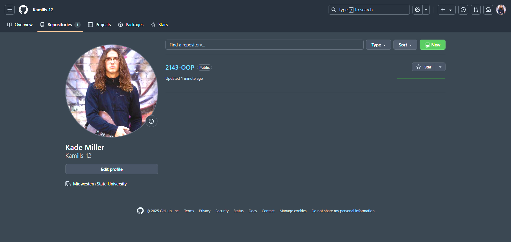

## A01 - Code Repository Setup  
### Kade Miller  
### Description:
This assignment proves that I set up my GitHub repository correctly for the course.  
It includes the required folder structure, README files, and a working image embedded in Markdown.

---

### Files in this Assignment

| # | File | Description |
|:-:|------|-------------|
| 1 | [README.md](README.md) | This file. Describes Assignment 1 setup. |
| 2 | [Proof.png](Proof.png) | Screenshot of my GitHub repo. |

---

### Screenshot Proof

---

### Instructions

No code to run. Just make sure the repository:
- Is named correctly (`2143-OOP`)
- Has a `README.md` 
- Contains this assignment folder (`A01`) with a README and screenshot

---

### Notes

- This repo will hold all future assignments for this class.
