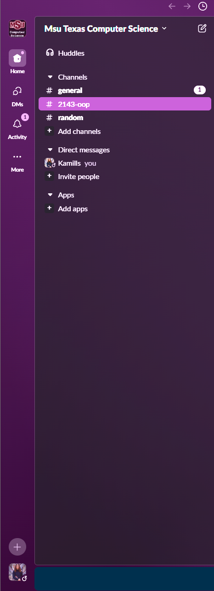

## A02 - Slack Setup  
### Kade Miller  

---

### Description:

This assignment confirms that I have joined the class Slack channel and completed the setup. Slack will be our main communication tool for asking questions, sharing code, and getting help outside of class time via Zoom.

---

### Checklist:

| Step | Notes |
|------|-------|
| Joined Slack Channel | [griffin-courses.slack.com](https://griffin-courses.slack.com) |
| Added Profile Photo or Avatar | Matches the one used on GitHub |
| Added Myself to Class Roster | Visible on Slack |
| Installed Slack App | On both PC and phone |

---

### Notes:

Slack will be critical for success in this class. I’ve installed it on all my devices to stay connected and get help whenever needed. I will be using the OOP class channel for asking questions.

---

### Proof of Slack Profile

---

### Tips I Picked Up:

- Slack allows for code formatting using triple backticks.
- I can ask questions in public or private channels.
- Participation = better performance.
